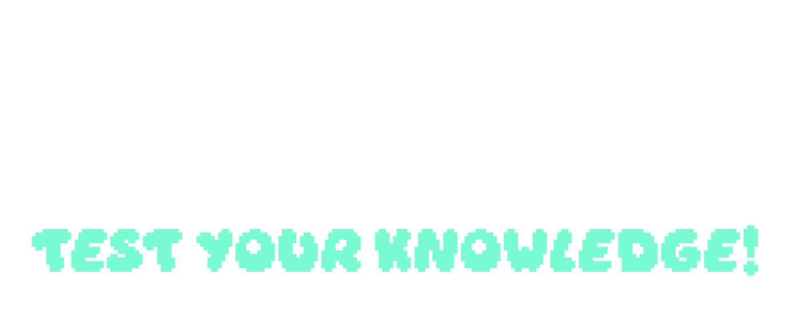
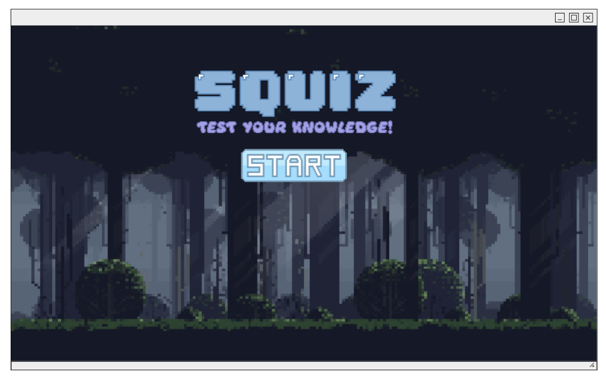
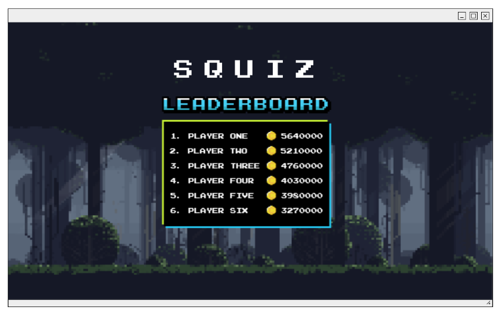
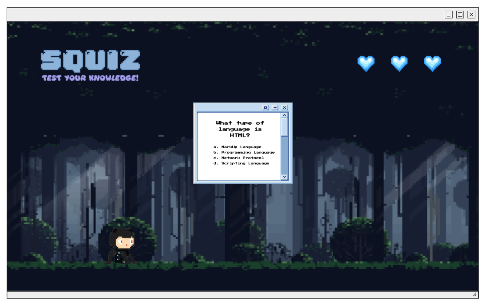
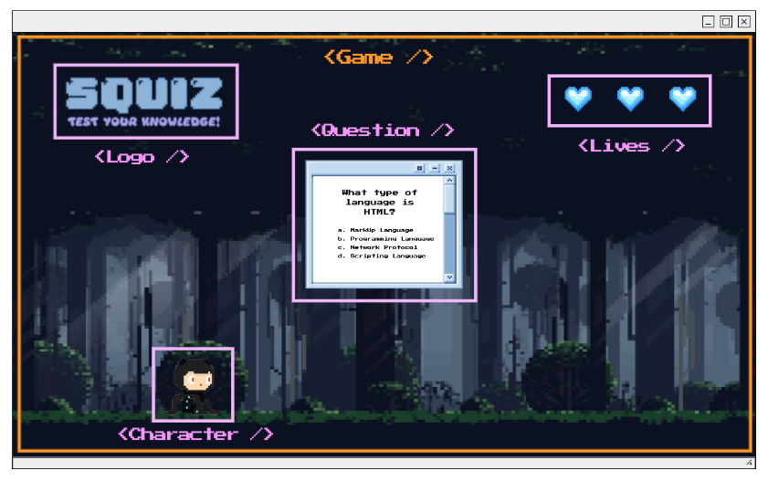
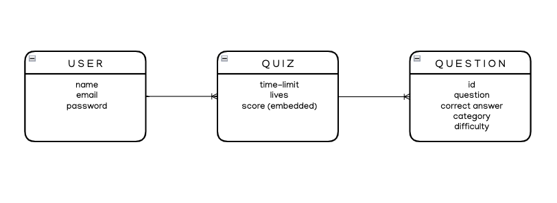

    

#

### [CLICK TO DEMO]()

##### Created by Alex E. Houston

## :pencil: Description

Squiz is a full MERN-stack single-page web application & quiz game created with React.js. Squiz tests your knowledge on software development and makes learning fun.

    
:art: Wireframes

        

        

        

        

    
:file_folder: ERD

        

    
:gear: Functionality

        <h3 align="center">Home Page</h3>
        

        <h3 align="center">Leaderboard</h3>
        

        <h3 align="center">Gameplay</h3>
        

## :computer: Technologies Used

## :link: Links

  
Trello Board

  <a href="https://trello.com/b/bAEDRVM1/squiz">Click here!</a>

  
Deployed Link

  <a href="">Squiz</a>

## :fast_forward: Next Steps

### Upcoming Features

- [ ] Allow users to choose between Easy, Normal and Hard modes at the start of the game.

- [ ] Allow users to choose their character at the start of the game.

- [ ] Allow users to choose their environments (backgrounds) at the start of the game.

- [ ] Allow users to choose the topic they'd like to be quizzed on at the start of the game.